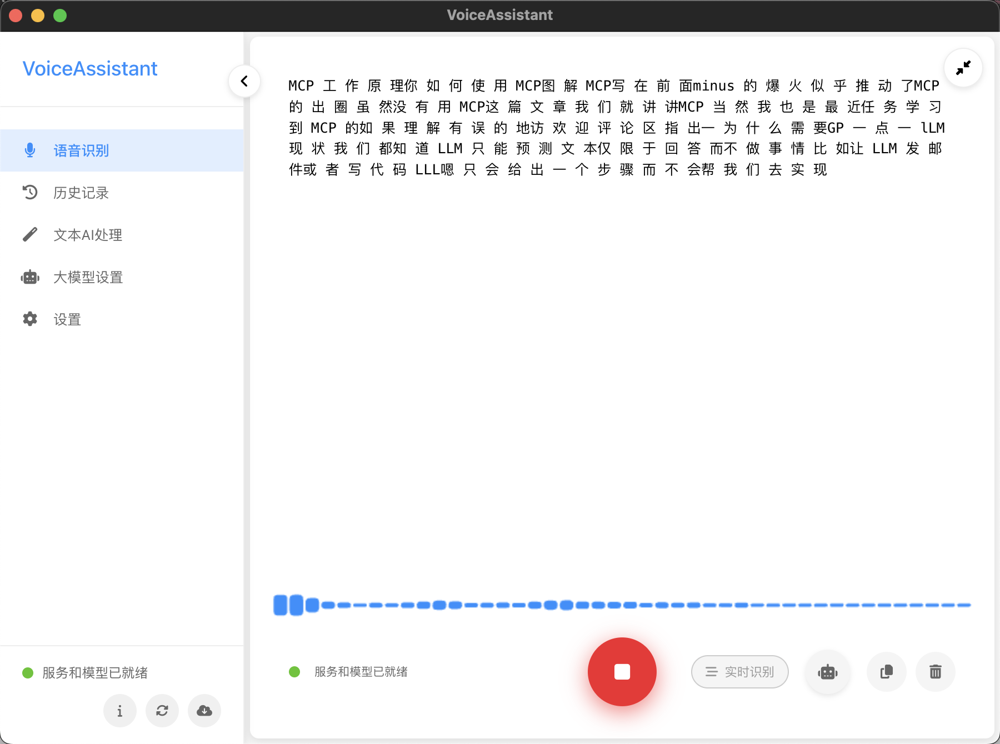

# Voice_Assistant - 跨平台语音识别应用

基于 FunASR 的跨平台[实时]AI 语音识别桌面应用，支持 Windows、macOS 和 Linux。

因 linux 打包文件较大，所以 release 没有 linux 版本，用户可以根据下方教程自己运行起来(教程很细也很简单)

## 软件截图



## 下载

[window 和 macos 下载](https://github.com/qkl9527/voice-assistant/releases)

linux 版本请自己按下面教程可直接运行 或 编译后运行

## 功能特点

- 实时 AI 语音识别, 基于 FunASR 的高精度语音识别
- 自动将识别文本插入到当前系统焦点位置
- 语音对话的历史记录管理
- 简洁直观的用户界面，用户可自定义大部分配置
- 跨平台支持 (Windows, macOS, Linux)
- 支持 CPU / GPU 正在处理中

## 使用说明

1. 启动应用后，等待 FunASR 模型加载完成
2. 点击"开始录音"按钮开始语音识别
3. 说话后点击"停止录音"按钮
4. 识别结果将显示在文本框中
5. 如果勾选了"自动插入文本"，识别结果将自动插入到当前焦点位置
6. 也可以点击"插入文本"按钮手动插入文本

## 启动失败说明

1. 失败说明：
   启动客户端后，第一次 `启动服务`，程序会自动下载`语音模型`到本地，可能需要等待一段时间，等待下载和服务启动完成，即可使用
2. 解决方法：
   - 先关闭再启动
   - 点击侧边栏右下角的重启图标尝试重启服务

## 功能规划(feature)

- [x] 增加 AI 文本模型能力
  - [x] 增加 AI 处理文字功能：错别字修正、概述、润色、翻译等
  - [x] 集成 AI 到语音识别页面
  - [x] 测试模型效果
- [ ] 优化实时语音交互优化(当前实时转录效果不太佳)
- [ ] 支持本地上传视频或语音识别
- [ ] 支持 GPU(学习如何打包 GPU 版 Torch 和 cuda 依赖)
- [ ] 增加声音克隆
- [ ] 增加语音转文本(TTS)
- [ ] 增加文本处理工作流

## 技术栈

- **前端**: Electron + Vue3
- **后端**: Python + Flask
- **语音识别**: FunASR
- **文本插入**: 平台特定实现 (Windows/macOS/Linux)

## 系统要求

- **操作系统**: Windows 10+, macOS 10.15+, 或 Linux (Ubuntu 20.04+)
- **Node.js**: v14+
- **Python**: 3.8+
- **内存**: 至少 4GB RAM (推荐 8GB+)
- **存储**: 至少 2GB 可用空间

## 安装与运行

### 方法一: 使用启动脚本（推荐）

启动脚本会自动使用 uv 创建虚拟环境，并安装所有依赖。

#### Windows

```
.\start.bat
```

#### macOS / Linux

```
chmod +x start.sh
./start.sh
```

### 方法二: 使用 uv 手动安装

1. 安装 uv:

```
pip install uv
```

2. 创建虚拟环境:

```
uv venv .venv
```

3. 激活虚拟环境:

   - Windows:

   ```
   .venv\Scripts\activate
   ```

   - macOS / Linux:

   ```
   source .venv/bin/activate
   ```

4. 安装 Python 依赖:

```
cd backend
uv pip install -r requirements.txt
cd ..
```

5. 安装 Node.js 依赖:

```
cd frontend
npm install
cd ..
```

6. 启动应用:

```
cd frontend
npm run electron:dev
```

### 方法三: 使用传统 pip 手动安装

1. 创建虚拟环境:

```
python -m venv .venv
```

2. 激活虚拟环境:

   - Windows:

   ```
   .venv\Scripts\activate
   ```

   - macOS / Linux:

   ```
   source .venv/bin/activate
   ```

3. 安装 Python 依赖:

```
cd backend
pip install -r requirements.txt
cd ..
```

4. 复制你当前系统的 ffmpeg 文件到.venv/bin

```
brew install ffmpeg
cp $(which ffmpeg) .venv/bin/
```

5. 安装 Node.js 依赖:

```
cd frontend
npm install
cd ..
```

6. 启动应用:

```
cd frontend
npm run electron:dev
```

## 单独启动后端服务

如果您需要单独启动后端服务（例如进行调试或开发），可以按照以下步骤操作：

1. 确保已经激活虚拟环境：

   - Windows:

   ```
   .venv\Scripts\activate
   ```

   - macOS / Linux:

   ```
   source .venv/bin/activate
   ```

2. 进入后端目录并启动服务：

```
cd backend
python app.py [port]
```

其中 `[port]` 是可选参数，指定服务要监听的端口号，默认为 5000。

服务启动后，您将看到类似于以下的输出：

```
 * Running on http://127.0.0.1:5000
```

这表示服务已经成功启动。

## 使用说明

参考开头的`使用说明`部分

## 构建应用

### 构建独立的可执行文件

```
cd frontend
npm run electron:build
```

构建后的应用将位于 `frontend/release` 目录中。

### 打包后的应用使用说明

打包后的应用包含了所有必要的依赖，包括 Python 环境和 FunASR 模型。用户可以直接运行安装程序或可执行文件，无需额外安装依赖。

#### Windows

1. 运行 `Voice_Assistant_[version].exe` 安装程序
2. 按照安装向导完成安装
3. 从开始菜单或桌面快捷方式启动 "Voice_Assistant"

#### macOS

1. 打开 `Voice_Assistant_[version].dmg` 文件
2. 将 "Voice_Assistant" 应用拖动到应用程序文件夹
3. 从启动台或应用程序文件夹启动 "Voice_Assistant"
4. 首次启动时，可能需要右键点击应用并选择"打开"以绕过 macOS 的安全限制

#### Linux

1. 下载 `Voice_Assistant_[version].AppImage` 文件
2. 设置执行权限：`chmod +x Voice_Assistant_[version].AppImage`
3. 运行应用：`./Voice_Assistant_[version].AppImage`

#### 首次运行注意事项

1. 首次启动时，应用将下载并加载 FunASR 模型，这可能需要一些时间
2. 请确保在使用录音功能前授予应用麦克风访问权限
3. 如果需要使用"自动插入文本"功能，可能需要授予应用额外的输入控制权限

#### 配置加速

```
npm config set registry https://mirrors.cloud.tencent.com/npm/
export ELECTRON_MIRROR="https://npmmirror.com/mirrors/electron/"
```

## 许可证

MIT

## 致谢

- [FunASR](https://github.com/modelscope/FunASR) - 语音识别引擎
- [Electron](https://www.electronjs.org/) - 跨平台桌面应用框架
- [Vue.js](https://vuejs.org/) - 前端框架
